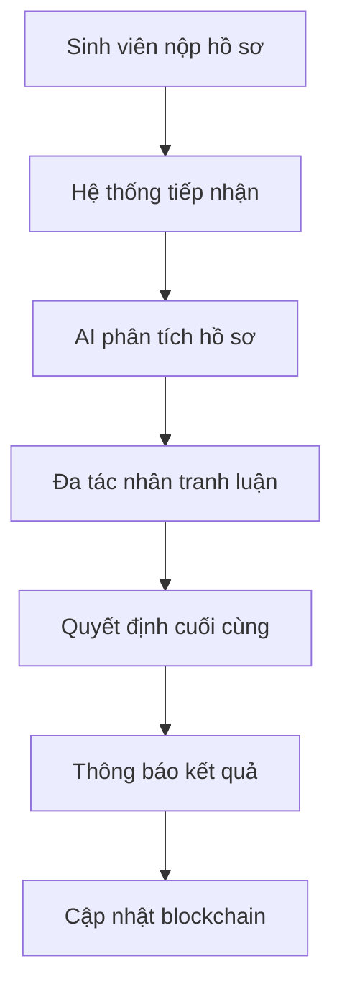
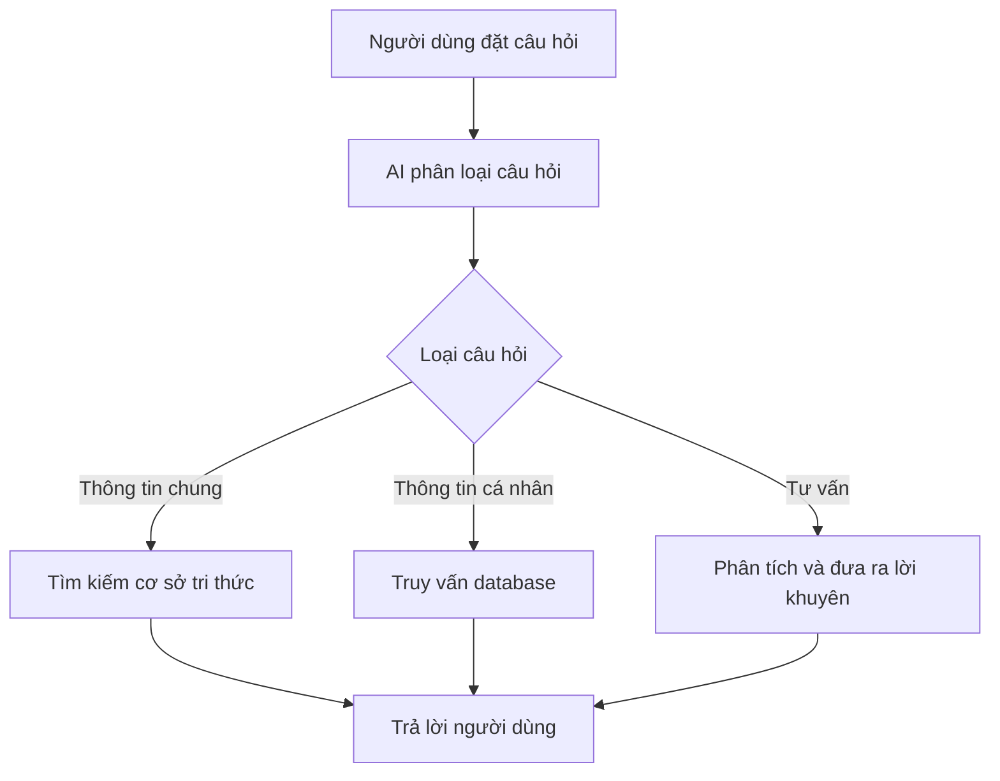

# 🏦 Hệ Thống Tín Dụng Sinh Viên Thông Minh

## 🎯 Giới Thiệu

Đây là một nền tảng công nghệ tiên tiến được thiết kế để cách mạng hóa ngành tín dụng sinh viên tại Việt Nam. Hệ thống kết hợp trí tuệ nhân tạo, blockchain và công nghệ real-time để tạo ra một giải pháp toàn diện, minh bạch và hiệu quả.

### 🌟 Tại sao chọn sản phẩm của chúng tôi?

- **🤖 Quyết định thông minh**: AI đánh giá hồ sơ vay một cách khách quan và chính xác
- **⛓️ Minh bạch tuyệt đối**: Blockchain đảm bảo tính xác thực và không thể giả mạo
- **💬 Tư vấn 24/7**: Chatbot AI hỗ trợ sinh viên mọi lúc, mọi nơi
- **⚡ Phản hồi tức thì**: Hệ thống real-time cập nhật trạng thái ngay lập tức

## 🏗️ Kiến Trúc Hệ Thống

```
┌─────────────────────────────────────────────────────────────────┐
│                   ECOSYSTEM                                     │
├─────────────────────────────────────────────────────────────────┤
│  🌐 Dịch Vụ Chính (Express.js)                                │
│  ├── API quản lý người dùng & hồ sơ vay                       │
│  ├── Hệ thống thông báo real-time                             │
│  ├── Tích hợp blockchain cho xác thực                         │
│  └── Quản lý dữ liệu và bảo mật                               │
├─────────────────────────────────────────────────────────────────┤
│  🧠 Dịch Vụ AI (Python)                                       │
│  ├── Hệ thống đa tác nhân đánh giá vay                        │
│  ├── Chatbot tư vấn thông minh                                │
│  ├── Xử lý tài liệu và tìm kiếm thông tin                     │
│  └── Ra quyết định dựa trên AI                                │
├─────────────────────────────────────────────────────────────────┤
│  🗄️ Lớp Dữ Liệu                                              │
│  ├── MongoDB (Dữ liệu chính)                                  │
│  ├── Pinecone (Cơ sở tri thức)                                │
│  └── Cloudinary (Lưu trữ file)                                │
└─────────────────────────────────────────────────────────────────┘
```

## 🚀 Tính Năng Nổi Bật

### 1. 🤖 Hệ Thống Đa Tác Nhân Thông Minh (MAS)

Imagine một hội đồng chuyên gia AI đánh giá hồ sơ vay của bạn:

- **👨‍🎓 Chuyên gia Học tập**: Đánh giá tiềm năng và thành tích học tập
- **💼 Chuyên gia Tài chính**: Phân tích khả năng trả nợ và rủi ro
- **🔍 Chuyên gia Phản biện**: Kiểm tra độ chính xác và logic
- **⚖️ Chuyên gia Quyết định**: Tổng hợp và đưa ra kết luận cuối cùng

**Lợi ích:** 
- Quyết định khách quan, không thiên vị
- Xem xét đa chiều, toàn diện
- Giảm thiểu sai sót của con người

### 2. 💬 Trợ Lý AI Tư Vấn Cá Nhân

Chatbot thông minh hiểu và trả lời mọi câu hỏi về vay vốn:

- **🔍 Tìm kiếm thông tin**: Tra cứu chính sách, điều kiện vay từ cơ sở tri thức
- **📊 Thông tin cá nhân**: Xem điểm GPA, lịch sử học tập, thông tin cá nhân
- **💡 Tư vấn thông minh**: Đưa ra lời khuyên phù hợp với tình huống cụ thể
- **🧠 Nhớ cuộc trò chuyện**: Duy trì ngữ cảnh, hiểu ý định người dùng

**Ví dụ sử dụng:**
- "Tôi có đủ điều kiện vay không?"
- "GPA của tôi hiện tại là bao nhiêu?"
- "Quy trình vay vốn như thế nào?"

### 3. ⛓️ Công Nghệ Blockchain Truvera

Đảm bảo tính minh bạch và bảo mật tuyệt đối:

- **🆔 Danh tính số**: Mỗi sinh viên có identity phi tập trung duy nhất
- **📜 Chứng chỉ số**: Bằng cấp, thành tích được số hóa và xác thực
- **🔐 Không thể giả mạo**: Thông tin được bảo vệ bởi cryptography
- **✅ Xác minh tức thì**: Kiểm tra tính hợp lệ chỉ trong vài giây

**Giá trị mang lại:**
- Loại bỏ gian lận hồ sơ
- Tăng độ tin cậy cho nhà cho vay
- Giảm thời gian xử lý hồ sơ

### 4. ⚡ Giao Tiếp Thời Gian Thực

Kết nối liền mạch giữa tất cả các bên:

- **📱 Thông báo tức thì**: Cập nhật trạng thái vay ngay lập tức
- **💬 Chat trực tiếp**: Trao đổi với tư vấn viên real-time
- **📊 Theo dõi tiến trình**: Xem trạng thái hồ sơ mọi lúc
- **🔔 Nhắc nhở thông minh**: Thông báo deadline, thủ tục cần hoàn thành

### 5. 📊 Quản Lý Dữ Liệu Toàn Diện

Hệ thống lưu trữ và xử lý dữ liệu hiệu quả:

- **🗃️ Dữ liệu người dùng**: Thông tin cá nhân, học tập, tài chính
- **📚 Cơ sở tri thức**: Chính sách, quy định, câu hỏi thường gặp
- **📸 Lưu trữ file**: Hình ảnh, tài liệu được lưu trữ an toàn
- **🔍 Tìm kiếm thông minh**: Tìm thông tin nhanh chóng và chính xác

## 🎯 Đối Tượng Sử Dụng

### 👨‍🎓 Sinh Viên
- Nộp hồ sơ vay vốn dễ dàng
- Nhận tư vấn 24/7 từ AI
- Theo dõi tiến trình xử lý real-time
- Quản lý thông tin học tập cá nhân

### 🏛️ Ngân Hàng/Tổ Chức Cho Vay
- Đánh giá rủi ro tự động và chính xác
- Xác minh thông tin sinh viên nhanh chóng
- Giảm thiểu gian lận và sai sót
- Tối ưu hóa quy trình duyệt vay

### 🏫 Trường Đại Học
- Xác thực thông tin sinh viên
- Hỗ trợ sinh viên tiếp cận nguồn vốn
- Theo dõi tình hình tài chính sinh viên

## 🛠️ Công Nghệ Sử Dụng

### 🖥️ Backend Core
- **Node.js + Express**: Server chính, API REST
- **Python + FastAPI**: Dịch vụ AI và xử lý dữ liệu
- **MongoDB**: Cơ sở dữ liệu chính
- **Socket.IO**: Giao tiếp real-time

### 🤖 Artificial Intelligence
- **OpenAI GPT-4**: Large Language Model cho chatbot
- **LlamaIndex**: Framework phát triển hệ thống chatbot và hệ thống phê duyệt cho vay
- **Pinecone**: Vector database cho semantic search

### ⛓️ Blockchain & Security
- **Truvera**: Blockchain platform cho verifiable credentials
- **JWT**: Authentication và authorization
- **bcrypt**: Mã hóa mật khẩu
- **CORS**: Bảo mật cross-origin

### ☁️ Cloud & Storage
- **Docker**: Containerization
- **Cloudinary**: Lưu trữ hình ảnh và file
- **MongoDB Atlas**: Cloud database

## 📱 Hướng Dẫn Sử Dụng

### 🚀 Khởi Chạy Nhanh

#### Yêu Cầu Hệ Thống
- Docker & Docker Compose
- 4GB RAM trở lên
- Kết nối internet ổn định

#### Cài Đặt Đơn Giản
```bash
# 1. Tải mã nguồn
git clone https://github.com/your-repo/attacker-backend.git
cd attacker-backend

# 2. Khởi chạy hệ thống
make build
make container-up

# 3. Kiểm tra trạng thái
make logs
```

#### Truy Cập Hệ Thống
- **API Documentation**: http://localhost:5000/api-docs
- **AI Service**: http://localhost:8000/docs
- **Health Check**: http://localhost:5000/health

### ⚙️ Cấu Hình Môi Trường

Tạo file `.env` với các thông tin cần thiết:

```bash
# Database
CONNECTION_STRING=your-mongodb-connection
DATABASE_NAME=Attacker_Database

# AI Services
OPENAI_API_KEY=your-openai-key
PINECONE_API_KEY=your-pinecone-key

# Blockchain
TRUVERA_API=https://api-testnet.truvera.io
ISSUER_DID=your-issuer-did

# Security
JWT_SECRET=your-secret-key

# File Storage
CLOUDINARY_CLOUD_NAME=your-cloud-name
CLOUDINARY_API_KEY=your-api-key
```

## 📊 Workflow Hoạt Động

### 🔄 Quy Trình Đánh Giá Vay Vốn



### 💬 Quy Trình Chatbot



## 🎯 API Endpoints Chính

### 🔐 Authentication
- `POST /api/auth/register` - Đăng ký tài khoản
- `POST /api/auth/login` - Đăng nhập
- `POST /api/auth/refresh` - Làm mới token

### 👤 Quản lý người dùng
- `GET /api/users/profile` - Xem thông tin cá nhân
- `PUT /api/users/profile` - Cập nhật thông tin
- `POST /api/users/upload-avatar` - Upload ảnh đại diện

### 🎓 Quản lý sinh viên
- `POST /api/students` - Tạo hồ sơ sinh viên
- `GET /api/students/:id` - Xem thông tin sinh viên
- `PUT /api/students/:id` - Cập nhật thông tin

### 💰 Quản lý vay vốn
- `POST /api/loans` - Tạo đơn vay
- `GET /api/loans` - Danh sách đơn vay
- `GET /api/loans/:id` - Chi tiết đơn vay
- `PUT /api/loans/:id` - Cập nhật trạng thái

### 🤖 AI Services
- `POST /api/v1/debate-loan` - Đánh giá hồ sơ vay qua MAS
- `POST /api/v1/chat` - Chat với AI chatbot

### 📊 Báo cáo & Thống kê
- `GET /api/v1/mas-conversations` - Lịch sử đánh giá MAS
- `GET /api/v1/mas-statistics` - Thống kê hệ thống

## 🔐 Bảo Mật & Quyền Riêng Tư

### 🛡️ Bảo Mật Dữ Liệu
- **Mã hóa end-to-end**: Tất cả dữ liệu được mã hóa
- **Authentication mạnh**: JWT với thời gian hết hạn
- **Role-based access**: Phân quyền theo vai trò
- **Input validation**: Kiểm tra đầu vào nghiêm ngặt

### 🔒 Quyền Riêng Tư
- **GDPR compliant**: Tuân thủ quy định bảo vệ dữ liệu
- **Data minimization**: Chỉ thu thập dữ liệu cần thiết
- **User consent**: Xin phép trước khi xử lý dữ liệu
- **Right to be forgotten**: Quyền xóa dữ liệu cá nhân

## 📈 Hiệu Suất & Khả Năng Mở Rộng

### ⚡ Tối Ưu Hiệu Suất
- **Caching thông minh**: Giảm thời gian phản hồi
- **Database indexing**: Tăng tốc truy vấn
- **Async processing**: Xử lý bất đồng bộ
- **Load balancing**: Phân tải hệ thống

### 📊 Khả Năng Mở Rộng
- **Microservices**: Kiến trúc dễ mở rộng
- **Horizontal scaling**: Thêm server khi cần
- **Cloud-ready**: Sẵn sàng deploy lên cloud
- **API-first**: Dễ tích hợp với hệ thống khác

## 🔧 Cài Đặt Chi Tiết

### 📁 Cấu Trúc Project

```
Attacker-Backend/
├── services/
│   ├── express-service/          # Node.js API Service
│   │   ├── src/
│   │   │   ├── controllers/      # API controllers
│   │   │   ├── models/           # Database models
│   │   │   ├── routes/           # API routes
│   │   │   ├── services/         # Business logic
│   │   │   └── config/           # Configuration
│   │   └── package.json
│   │
│   └── python-service/           # AI Service
│       ├── app/
│       │   ├── agents/           # Multi-Agent System
│       │   ├── botagent/         # RAG Chatbot
│       │   ├── core/             # Core workflows
│       │   └── routes/           # FastAPI routes
│       └── requirements.txt
│
├── docker-compose.yml            # Container orchestration
├── Makefile                      # Build commands
└── README.md                     # This file
```

### 🐳 Docker Commands

```bash
# Khởi chạy tất cả services
make container-up

# Dừng services
make container-down

# Build lại images
make build

# Xem logs
make logs

# Chạy riêng lẻ
make express-service
make python-service
```

## 🤝 Đóng Góp & Phát Triển

### 🌟 Cách Thức Đóng Góp
1. Fork repository về tài khoản của bạn
2. Tạo branch mới cho feature
3. Phát triển và test kỹ lưỡng
4. Tạo Pull Request với mô tả chi tiết
5. Code review và merge

### 📋 Quy Tắc Coding
- **Clean Code**: Code sạch, dễ đọc
- **Documentation**: Comment và document đầy đủ
- **Testing**: Test coverage tối thiểu 80%
- **Security**: Luôn xem xét bảo mật

## 🆘 Hỗ Trợ & Liên Hệ

### 📞 Kênh Hỗ Trợ
- **Email**: 23520123@gm.uit.edu.vn

### 🐛 Báo Lỗi
Khi gặp vấn đề, vui lòng cung cấp:
- Mô tả chi tiết lỗi
- Các bước tái hiện
- Screenshots nếu có
- Log files liên quan

## 🎉 Lời Cảm Ơn

### 💝 Đối Tác Công Nghệ
- **OpenAI**: Cung cấp GPT-4 API
- **Pinecone**: Vector database platform
- **Truvera**: Blockchain infrastructure
- **MongoDB**: Cloud database solutions

*Cách mạng hóa ngành tín dụng sinh viên thông qua công nghệ AI và Blockchain*
